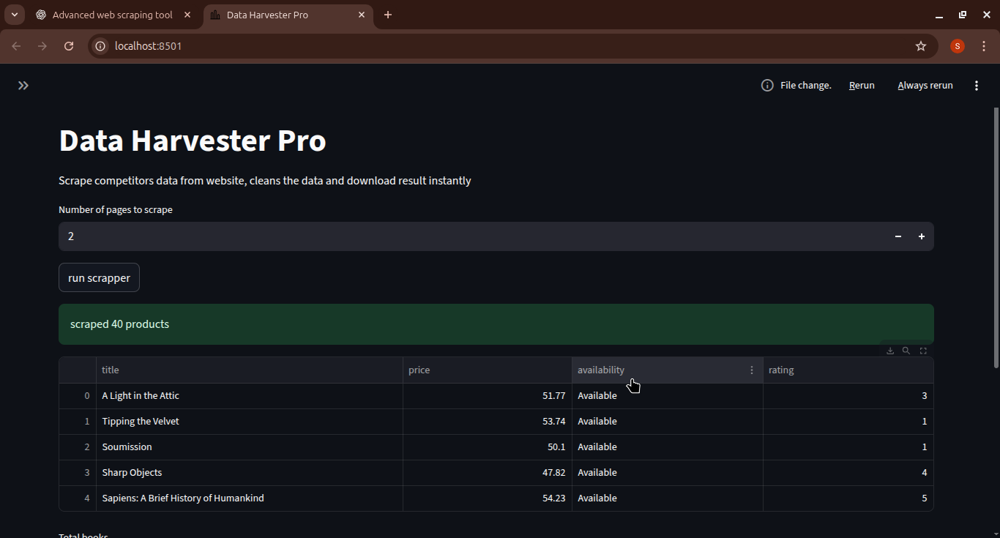

# 📊 Data Harvester Pro  

**Automated Web Scraping, Data Cleaning & Interactive Dashboard**  

---

## 🚀 Overview
Data Harvester Pro is a **Python-powered web scraping and analytics tool** that collects, cleans, and visualizes data from e-commerce websites.  
Designed for **speed, automation, and clarity**, this app lets you track product information, analyze pricing trends, and download datasets — all through an **interactive Streamlit dashboard**.  

Perfect for **competitor monitoring, e-commerce analytics, or personal portfolio projects**.  

---

## 🛠️ Features
- 🔎 **Automated Web Scraping** – Extract book/product data including title, price, availability, and rating.  
- 🧹 **Data Cleaning Pipeline** – Standardizes prices, normalizes availability, converts textual ratings to numeric.  
- 📊 **Interactive Dashboard** – Explore datasets with metrics, charts, and filters in real-time.  
- 📥 **Export Options** – Download datasets as **Excel** or **CSV**, or sync directly to **Google Sheets**.  
- ⏰ **Automation Ready** – Schedule daily scraping with **APScheduler** or **GitHub Actions**.  
- 📧 **Email Notifications** – Optional alerts with fresh datasets when new data is available.  

---

## 🖥️ Demo  
  

- Filter by **availability**, **price range**, and **ratings**.  
- Download cleaned datasets instantly.  
- Metrics and charts show insights at a glance.  

---

## ⚙️ Tech Stack
- **Python 3.10+** – Core language  
- **BeautifulSoup4 & Requests** – Web scraping  
- **Pandas** – Data cleaning and transformation  
- **Streamlit** – Interactive dashboard  
- **gspread + Google Sheets API** – Cloud integration  
- **APScheduler / GitHub Actions** – Automation and scheduling  

---

## 📂 Project Structure
data-harvester-pro/
│── dashboard.py # Streamlit dashboard
│── run.py # Main scraping & cleaning script
│── utils/ # Helper modules (scraper, cleaner, exporter)
│── requirements.txt # Dependencies
│── .gitignore # Ignore secrets and temp files
│── images/ # Screenshots and visuals
│── README.md # Project documentation


---

## 🎯 Use Cases
- Competitor price monitoring  
- E-commerce product catalog tracking  
- Daily/weekly automated reporting  
- Portfolio project showcasing Python & data skills  

---

## 💻 Getting Started
1. Clone the repo:  
```bash
git clone https://github.com/yourusername/data-harvester-pro.git
cd data-harvester-pro

Install dependencies:

pip install -r requirements.txt


Run locally:

streamlit run dashboard.py


